# CDK Infrastructure Documentation

## アーキテクチャ概要

本CDKコードは、AWS Well-Architected Frameworkに基づいて設計されたフルマネージドなWebアプリケーションインフラストラクチャをデプロイします。

### 新アーキテクチャ構成

```mermaid
graph TB
    subgraph "Internet"
        Users[Users]
    end

    subgraph "DNS"
        Route53[Route53<br/>Environment-specific Domain<br/>DEV: genu.muew.dev<br/>PROD: prod.example.com<br/>TEST: test.example.com]
    end

    subgraph "AWS Account"
        subgraph "Network Load Balancer"
            EIP[Elastic IP<br/>Static IP Address]
            NLB[Network Load Balancer<br/>L4 Load Balancing]
        end

        subgraph "VPC (10.26.0.0/16)"
            subgraph "Availability Zone A (ap-northeast-1a)"
                subgraph "Public Subnet A (10.26.0.0/24)"
                    ALB_A[ALB Target<br/>AZ-A]
                    NATGW_A[NAT Gateway AZ-A<br/>External API Access<br/>全環境]
                end

                subgraph "Private Subnet A (10.26.2.0/24)"
                    ECS_FE_A[Frontend ECS<br/>Next.js SSR<br/>AZ-A]
                    ECS_BE_A[Backend ECS<br/>FastAPI<br/>AZ-A]
                    BASTION[Bastion Host<br/>t3.micro<br/>Session Manager Access]
                end

                subgraph "DB Subnet A (10.26.4.0/24)"
                    Aurora_A[Aurora PostgreSQL 17.5<br/>Writer Instance<br/>+ pgvector 0.8.0<br/>generative_ai_db<br/>bedrock_integration schema<br/>AZ-A]
                end
            end

            subgraph "Availability Zone B (ap-northeast-1c)"
                subgraph "Public Subnet B (10.26.1.0/24)"
                    ALB_B[ALB Target<br/>AZ-B]
                    NATGW_B[NAT Gateway AZ-B<br/>External API Access<br/>本番環境のみ]
                end

                subgraph "Private Subnet B (10.26.3.0/24)"
                    ECS_FE_B[Frontend ECS<br/>Next.js SSR<br/>AZ-B]
                    ECS_BE_B[Backend ECS<br/>FastAPI<br/>AZ-B]
                end

                subgraph "DB Subnet B (10.26.5.0/24)"
                    Aurora_B[DB Subnet Only<br/>Failover Ready<br/>AZ-B]
                end
            end

            subgraph "VPC Endpoints (Multi-AZ)"
                VPE_S3[S3 Gateway]
                VPE_CWL[CloudWatch Logs]
            end


            ALB[Application Load Balancer<br/>Multi-AZ Distribution<br/>+ Cognito OIDC Auth]
        end

        subgraph "Cognito"
            UserPool[User Pool]
            UserPoolClient[User Pool Client]
            UserPoolDomain[User Pool Domain]
        end

        subgraph "Certificate Manager"
            ACM[SSL Certificate<br/>Single Domain<br/>Per Environment]
        end

        subgraph "Secrets Manager"
            DB_SECRET[Aurora Credentials]
        end

        subgraph "ECR"
            ECR_FE[Frontend Image Repository]
            ECR_BE[Backend Image Repository]
        end

        subgraph "CloudWatch"
            CW_LOGS_FE[CloudWatch Logs<br/>/ecs/frontend-service]
            CW_LOGS_BE[CloudWatch Logs<br/>/ecs/backend-service]
        end

        subgraph "Amazon Bedrock"
            BEDROCK[Bedrock Runtime API<br/>Claude 3.5 Sonnet<br/>Titan Image Generator]
            KB[Knowledge Base<br/>generative-ai-rag-kb-ENV]
        end

        subgraph "RAG Infrastructure"
            subgraph "S3 RAG Documents"
                S3_RAG[S3 RAG Bucket<br/>gen-ai-rag-docs-ENV<br/>documents/ prefix<br/>PDF, TXT, DOCX, MD]
            end

            subgraph "Database Setup Automation"
                RDS_SETUP[RDS Data Setup<br/>Custom Resource<br/>pgvector extension<br/>bedrock_integration schema<br/>bedrock_kb table<br/>HNSW Index]
            end
        end
    end

    %% Connections
    Users --> Route53
    Route53 --> EIP
    EIP --> NLB
    NLB --> ALB
    ALB --> ALB_A
    ALB --> ALB_B
    ALB_A -->|"/ *"| ECS_FE_A
    ALB_A -->|"/api/*"| ECS_BE_A
    ALB_B -->|"/ *"| ECS_FE_B
    ALB_B -->|"/api/*"| ECS_BE_B
    ECS_BE_A --> Aurora_A
    ECS_BE_B --> Aurora_A
    ALB -->|Cognito OIDC Auth| UserPool
    ALB --> UserPoolClient
    ALB --> UserPoolDomain
    Aurora_A --> DB_SECRET
    ECS_FE_A -->|Logs| VPE_CWL
    ECS_FE_B -->|Logs| VPE_CWL
    ECS_BE_A -->|Logs| VPE_CWL
    ECS_BE_B -->|Logs| VPE_CWL
    VPE_CWL --> CW_LOGS_FE
    VPE_CWL --> CW_LOGS_BE
    ECS_BE_A -->|External APIs| NATGW_A
    ECS_BE_B -->|External APIs| NATGW_A
    ECS_BE_B -.->|本番Multi-AZ| NATGW_B
    NATGW_A -->|Internet| BEDROCK
    NATGW_B -.->|Internet| BEDROCK
    BASTION -->|Session Manager| NATGW_A
    BASTION -->|Database Access| Aurora_A
    ALB --> ACM
    
    %% RAG Connections
    S3_RAG -->|Data Source| KB
    KB -->|Vector Storage| Aurora_A
    RDS_SETUP -->|Database Setup| Aurora_A
    ECS_BE_A -->|RAG API| KB
    ECS_BE_B -->|RAG API| KB
    ECS_BE_A -->|Document Upload| S3_RAG
    ECS_BE_B -->|Document Upload| S3_RAG

    %% Styling
    classDef aws fill:#FF9900,stroke:#333,stroke-width:2px,color:#fff
    classDef service fill:#4CAF50,stroke:#333,stroke-width:2px,color:#fff
    classDef data fill:#2196F3,stroke:#333,stroke-width:2px,color:#fff
    classDef optional fill:#FFC107,stroke:#333,stroke-width:2px,color:#000
    classDef management fill:#795548,stroke:#333,stroke-width:2px,color:#fff
    classDef rag fill:#E8F5E8,stroke:#4CAF50,stroke-width:3px,color:#000
    classDef az_a fill:#E3F2FD,stroke:#1976D2,stroke-width:2px,color:#000
    classDef az_b fill:#F3E5F5,stroke:#7B1FA2,stroke-width:2px,color:#000

    class NLB,ALB,Route53,BEDROCK aws
    class Aurora_A,Aurora_B,S3_MEDIA data
    class UserPool,UserPoolClient,UserPoolDomain,ECS_FE_A,ECS_FE_B,ECS_BE_A,ECS_BE_B service
    class ACM optional
    class BASTION management
    class KB,S3_RAG,RDS_SETUP rag
    class NATGW_A aws
    class NATGW_B optional
    class ALB_A,ECS_FE_A,ECS_BE_A,Aurora_A,BASTION,NATGW_A az_a
    class ALB_B,ECS_FE_B,ECS_BE_B,Aurora_B,NATGW_B az_b
```



## 実装されたコンポーネント

**リージョン設定**: 本インフラは**ap-northeast-1 (東京)リージョン**を標準とします。

- VPC、ECS、Aurora等の主要リソース: ap-northeast-1
- Amazon Bedrock: ap-northeast-1対応済み
- Route53: グローバルサービス（環境別ドメイン使用）
- ACM証明書: ap-northeast-1で取得（環境別単一ドメイン）

### 1. DNS・ネットワーク層

- **Route53**: 環境別ドメインのホストゾーン
  - DEV: genu.muew.dev (手動作成済み - Zone ID: Z06924452U2Z12SVXR7YX)
  - PROD: prod.example.com (設定予定)
  - TEST: test.example.com (設定予定)
- **Elastic IP**: 静的IPアドレス（ファイアウォール・ホワイトリスト対応）
- **Network Load Balancer**: L4ロードバランシング、固定IP提供
- **ACM Certificate**: 環境別単一ドメイン証明書（DNS検証）
- **VPC**: 10.26.0.0/16 CIDR
- **パブリックサブネット**: 2つのAZ（ALB配置用）
- **プライベートサブネット**: 2つのAZ（ECSタスク配置用）
- **データベースサブネット**: 最低2つのサブネット（Aurora要件）、異なるAZに配置
- **VPCエンドポイント**: S3 Gateway、CloudWatch Logs Interface（最適化済み）
- **NAT Gateway**: 外部API通信用
  - **開発環境**: 1個（AZ-A のみ）- コスト最適化
  - **本番環境**: 2個（AZ-A + AZ-B）- Multi-AZ冗長性

### 2. 認証層 (Auth Construct)

- **Cognito User Pool**: 統合認証システム
- **User Pool Client**: OAuth2設定（Client Secret有効）
- **User Pool Domain**: ALB OIDC認証統合用
- **ALB OIDC認証**: Application Load Balancerレベルでの認証

### 3. データベース層 (Database Construct)

- **Aurora PostgreSQL Provisioned**: 固定性能のデータベース（t3.medium）
- **データベース認証情報**:
  - クラスター名: `{stackName}-aurora-cluster`
  - データベース名: `generative_ai_db`
  - ユーザー名: `postgres`
  - パスワード: Secrets Managerで自動生成（32文字）
  - Secret名: `generative-ai-use-cases/aurora-credentials`
  - ポート: `5432`
- **Secrets Manager**: 認証情報の安全な管理
- **バックアップ設定**: 7日間保持

### 4. コンピューティング層 (ECS Construct)

- **ECS Fargate Cluster**: コンテナオーケストレーション
- **Frontend Service**: Next.js 15 SSR - ECS Fargateで実行
- **Backend Service**: FastAPI (Python 3.13) - ECS Fargateで実行
- **Auto Scaling設定** (Frontend/Backend共通):
  - **開発環境**: 最小タスク数: 1、最大タスク数: 4（Multi-AZ）
  - **本番環境**: 最小タスク数: 2、最大タスク数: 10（Multi-AZ）
  - CPU使用率70%でスケールアウト
  - スケールイン: 5分間隔、スケールアウト: 2分間隔
- **ヘルスチェック戦略**:
  - **コンテナレベル**: ヘルスチェック削除（curl依存回避）
  - **ALB Target Group**: Frontend `/health`, Backend `/api/health`
  - **自動復旧**: 不健全タスクの自動置換

### 4.1. CloudWatch Logs統合

- **Frontend Log Group**: `/ecs/frontend-service`（1週間保持）
- **Backend Log Group**: `/ecs/backend-service`（1週間保持）
- **Log Driver**: awslogs（ECSコンテナ標準）
- **VPC Endpoint**: CloudWatch Logsエンドポイント経由でログ送信（大量ログのため高速化）
- **アクセス**: AWSコンソール直接リンクをStack Outputsで提供

### 5. ロードバランサー層

#### 5.1. Network Load Balancer (NLB)

- **固定IP**: Elastic IP Address割り当て
- **L4ロードバランシング**: TCPレベルでの高速処理
- **ターゲット**: Application Load Balancer

#### 5.2. Application Load Balancer (ALB)

- **L7ロードバランシング**: HTTPSルーティング
- **SSL終端**: ACM証明書による暗号化通信
- **認証統合**: Cognito OIDC認証
- **ルーティングルール**:
  - `/api/*` → Backend ECS Service
  - その他すべて (`/*`) → Frontend ECS Service
- **Health Check設定**:
  - Frontend: `/health`
  - Backend: `/api/health`
  - プロトコル: HTTP
  - 間隔: 30秒、タイムアウト: 5秒

### 6. 認証フロー

#### ALB + Cognito OIDC認証フロー

1. **未認証アクセス**: ユーザーが環境別URL（例: https://genu.muew.dev/）にアクセス
2. **認証チェック**: ALBがCognito認証状態を確認
3. **認証リダイレクト**: 未認証の場合、Cognito Hosted UIにリダイレクト
4. **ログイン処理**: ユーザーがCognito UIでログイン
5. **認証コールバック**: Cognito → ALB `/oauth2/idpresponse`
6. **認証ヘッダー**: ALBが認証済みリクエストにユーザー情報ヘッダーを追加
   - `x-amzn-oidc-identity`: Cognito Identity
   - `x-amzn-oidc-data`: ユーザー情報（Base64エンコード済み）
7. **サービス振り分け**: Frontend/Backend ECSに転送

#### 認証例外パス

- `/api/health`: Backend ヘルスチェック用（認証不要）
- `/health`: Frontend ヘルスチェック用（認証不要）
- その他すべてのパスで認証必須

**実装詳細**: ALBルーティングルールで高優先度（priority 50-100）にて認証例外を設定

## ECSヘルスチェックとログ監視戦略

### ALB Target Group ヘルスチェック実装

**設計方針**: コンテナレベルのヘルスチェック（curl依存）を削除し、ALB Target Groupベースのヘルスチェックに統一

#### Frontend Service ヘルスチェック

```typescript
// Frontend ECS Service
healthCheck: {
  enabled: true,
  path: '/health',
  protocol: elbv2.Protocol.HTTP,
  interval: cdk.Duration.seconds(30),
  timeout: cdk.Duration.seconds(5),
  healthyThresholdCount: 2,
  unhealthyThresholdCount: 5,
},
```

#### Backend Service ヘルスチェック

```typescript
// Backend ECS Service
healthCheck: {
  enabled: true,
  path: '/api/health',
  protocol: elbv2.Protocol.HTTP,
  interval: cdk.Duration.seconds(30),
  timeout: cdk.Duration.seconds(5),
  healthyThresholdCount: 2,
  unhealthyThresholdCount: 5,
},
```

### 認証統合実装

#### ALB認証ルール設定

```typescript
// 認証例外ルール: Backend /api/health は認証不要（最高優先度）
alb.addEcsTarget({
  service: backendService,
  priority: 50, // 最高優先度
  pathPattern: '/api/health',
  authRequired: false, // 認証不要
});

// 認証例外ルール: Frontend /health は認証不要（高優先度）
alb.addEcsTarget({
  service: frontendService,
  priority: 75, // 高優先度
  pathPattern: '/health',
  authRequired: false, // 認証不要
});

// バックエンドAPIターゲット（認証必須）
alb.addEcsTarget({
  service: backendService,
  priority: 100,
  pathPattern: '/api/*',
  authRequired: true, // Cognito認証必須
});

// フロントエンドターゲット（認証必須）
alb.addEcsTarget({
  service: frontendService,
  priority: 200,
  pathPattern: '/*',
  authRequired: true, // Cognito認証必須
});
```

## Multi-AZ構成の詳細

### Availability Zone配置

- **AZ-A (ap-northeast-1a)**:
  - Public Subnet: 10.26.0.0/24
  - Private Subnet: 10.26.2.0/24
  - DB Subnet: 10.26.4.0/24
- **AZ-B (ap-northeast-1c)**:
  - Public Subnet: 10.26.1.0/24
  - Private Subnet: 10.26.3.0/24
  - DB Subnet: 10.26.5.0/24

### 高可用性実現

1. **NLB**: 固定IPでの可用性確保
2. **ALB**: 両AZのPublic Subnetに配置、トラフィック分散
3. **ECS Frontend**: 両AZのPrivate Subnetでタスク実行
4. **ECS Backend**: 両AZのPrivate Subnetでタスク実行
5. **Aurora**: WriterはAZ-Aに配置、AZ-B障害時は自動フェイルオーバー

**設計方針**: 開発・本番環境ともにMulti-AZ構成を採用。追加コスト（月額約$9）に対して、本番相当環境でのテスト・AZ障害テストの価値が上回ると判断。

## リソース仕様と料金一覧

### デプロイされるAWSリソース詳細

#### 1. ネットワーク・DNS層

| リソース                       | 仕様                                          | 月額料金（概算） |
| ------------------------------ | --------------------------------------------- | ---------------- |
| **Route53 Hosted Zone**        | 環境別ドメイン（DEV: genu.muew.dev他）        | $0.50/月         |
| **Elastic IP**                 | 3個（NLB用2 + NAT Gateway用1）                | $0/月（使用中）  |
| **Network Load Balancer**      | Multi-AZ対応                                  | ~$18/月          |
| **NAT Gateway**                | DEV: 1個(AZ-A), PROD: 2個(AZ-A+AZ-B)          | DEV:~$16/月 PROD:~$32/月 |
| **ACM Certificate**            | 環境別単一ドメイン証明書                      | 無料             |
| **VPC**                        | 10.26.0.0/16, 2AZ対応                         | 無料             |
| **サブネット**                 | Public×2, Private×2, DB×2                     | 無料             |
| **インターネットゲートウェイ** | 標準                                          | 無料             |
| **ルートテーブル**             | 6個（サブネット毎）                           | 無料             |
| **VPCエンドポイント**          | Interface×1, Gateway×1 (CloudWatch Logs + S3) | ~$23/月          |

#### 2. コンピューティング層

| リソース                      | 仕様                                       | 月額料金（概算） |
| ----------------------------- | ------------------------------------------ | ---------------- |
| **ECS Fargate (Frontend)**    | 0.25 vCPU, 0.5GB RAM × 2タスク（Multi-AZ） | ~$14.5/月        |
| **ECS Fargate (Backend)**     | 0.25 vCPU, 0.5GB RAM × 2タスク（Multi-AZ） | ~$14.5/月        |
| **CloudWatch Logs**           | Frontend・Backend ログ収集                 | ~$6/月           |
| **Application Load Balancer** | Multi-AZ, HTTPS終端, Cognito認証           | ~$25/月          |
| **Target Group**              | 2個（Frontend/Backend用）                  | 無料             |

#### 3. データベース層

| リソース                          | 仕様                                       | 月額料金（概算） |
| --------------------------------- | ------------------------------------------ | ---------------- |
| **Aurora PostgreSQL Provisioned** | t3.medium × 1インスタンス, Multi-AZ Subnet | ~$69/月          |
| **Aurora Storage**                | ~20GB（推定）                              | ~$2/月           |
| **Automated Backup**              | 7日間保持                                  | ~$1/月           |

#### 4. 認証・セキュリティ層

| リソース              | 仕様                        | 月額料金（概算） |
| --------------------- | --------------------------- | ---------------- |
| **Cognito User Pool** | ~1,000 MAU（推定）          | ~$5/月           |
| **Secrets Manager**   | 1シークレット（DB認証情報） | ~$1/月           |
| **ECR Repository**    | 2リポジトリ, 2GB（推定）    | ~$1/月           |

#### 5. 管理・監視層

| リソース              | 仕様                                     | 月額料金（概算） |
| --------------------- | ---------------------------------------- | ---------------- |
| **Bastion Host**      | t3.micro, 30GB gp3 EBS, プライベート配置 | ~$8/月           |
| **VPCエンドポイント** | 上記に含む (Systems Manager用含む)       | 上記に含む       |

### 月額料金総計

| カテゴリ         | 開発環境（最小構成） | 本番環境（Multi-AZ） |
| ---------------- | -------------------- | -------------------- |
| **必須リソース** | **~$228/月**         | **~$260/月**         |
| **総計**         | **~$228/月**         | **~$260/月**         |

### 料金詳細の注記

**VPCエンドポイント最適化による変更点**:

- VPCエンドポイント削除: -$92/月（ECR、Secrets Manager、Bedrock Runtime、SSM関連）
- NAT Gateway追加: +$32/月（外部API通信・Session Manager用）
- EIP追加: $0/月（NAT Gateway用、使用中のため無料）
- **正味コスト削減**: **-$60/月**

**コスト最適化のポイント**:

1. **VPCエンドポイント最適化**: 低頻度API用エンドポイント削除（$92/月削減）
2. **NAT Gateway活用**: 外部API・Session Manager通信（$32/月追加）
3. **CloudWatch Logs VPC Endpoint保持**: 大量ログ送信の高速化
4. **S3 Gateway Endpoint保持**: 無料のため継続利用
5. **ECS Fargate**: ARM64（Graviton2）使用で約20%削減
6. **Aurora**: 実際の使用量に応じてt3.smallにダウングレード可能（~$35/月）

**セキュリティ設計**: Session Manager接続、Sentry等外部API監視、Bedrock AI推論はNAT Gateway経由で安全に実行

## アクセスURL

### 環境別アクセスURL

#### DEV環境

- **アプリケーションURL**: `https://genu.muew.dev/`
- **API エンドポイント**: `https://genu.muew.dev/api/`
- **認証**: Cognito Hosted UI（自動リダイレクト）

#### PROD環境（設定予定）

- **アプリケーションURL**: `https://prod.example.com/`
- **API エンドポイント**: `https://prod.example.com/api/`
- **認証**: Cognito Hosted UI（自動リダイレクト）

#### TEST環境（設定予定）

- **アプリケーションURL**: `https://test.example.com/`
- **API エンドポイント**: `https://test.example.com/api/`
- **認証**: Cognito Hosted UI（自動リダイレクト）

### 静的IP情報

- **Elastic IP**: Stack Outputsで表示
- **ファイアウォール・ホワイトリスト用**: 上記EIPを使用

## データベースアクセス（Bastion Host）

### 概要

セキュアなデータベースアクセスのため、AWS Systems Manager Session Manager経由でアクセス可能な踏み台サーバー（Bastion Host）を提供しています。

## デプロイメント戦略

### 1. 事前準備（手動）

#### DNS設定

**DEV環境**:

1. Route53でgenu.muew.devホストゾーン作成済み（Zone ID: Z06924452U2Z12SVXR7YX）
2. muew.dev管理者側でNS委任設定完了

**PROD/TEST環境**:

1. 各環境用のRoute53ホストゾーン作成が必要
2. ドメイン管理者側でのNS委任設定が必要

#### Bedrock準備

```bash
# Bedrockモデルアクセス許可（AWSコンソールで実施）
# - anthropic.claude-3-5-sonnet-20241022-v2:0
# - amazon.titan-image-generator-v2:0
```

### 2. CDKデプロイ

```bash
# 開発環境
npm run cdk:deploy:dev

# 本番環境
npm run cdk:deploy:prod
```

### 3. デプロイ内容

**自動実行される内容**:

1. **インフラ構築**: VPC, NLB, ALB, ECS, Aurora等
2. **ACM証明書**: 環境別ドメインの自動取得・DNS検証
3. **Docker Build**: Frontend/BackendのECRプッシュ
4. **ECS Deploy**: コンテナサービス起動
5. **Cognito設定**: OAuth URL自動更新（環境別ドメイン対応）

## 実装上の変更点

### 1. アーキテクチャ変更

#### 削除されたコンポーネント

- **CloudFront Distribution**: 静的IP要件により削除
- **S3 Static Assets Bucket**: Frontend ECSから配信に変更
- **Lambda@Edge認証**: ALB + Cognito OIDC認証に変更

#### 追加されたコンポーネント

- **Network Load Balancer**: 固定IP提供
- **Elastic IP**: 静的IPアドレス
- **Frontend ECS Service**: Next.js SSRサービス
- **ACM Certificate**: 環境別単一ドメイン証明書
- **Route53統合**: DNS管理

### 2. 認証方式変更

**従来**: Lambda@Edge + CloudFront認証
**新方式**: ALB + Cognito OIDC認証

**メリット**:

- ✅ 標準的なOIDC認証フロー
- ✅ ALBネイティブ認証機能
- ✅ 設定・運用がシンプル
- ✅ 固定IP要件を満たす

### 3. Frontend配信方式変更

**従来**: CloudFront + S3静的配信
**新方式**: ECS Fargate + Next.js SSR

**メリット**:

- ✅ Server-Side Rendering対応
- ✅ 動的コンテンツ生成
- ✅ バックエンドとの密結合
- ✅ 固定IP経由でのアクセス

## 環境別設定

### 削除ポリシー設定

| リソース               | 全環境設定 | 手動削除要 |
| ---------------------- | ---------- | ---------- |
| **Aurora Database**    | `DESTROY`  | ❌         |
| **Database削除保護**   | `false`    | ❌         |
| **S3 RAG Bucket**      | `DESTROY`  | ❌         |
| **S3自動削除**         | `true`     | ❌         |
| **Cognito User Pool**  | `DESTROY`  | ❌         |
| **Bedrock Knowledge Base** | `DESTROY`  | ❌         |
| **ECR Repository**     | 制御不可   | ✅         |
| **ACM Certificate**    | 制御不可   | ✅         |

## セキュリティ機能

### 1. ネットワークセキュリティ

- **VPC**: プライベートネットワーク分離
- **Security Groups**: 最小権限の原則
- **NACLs**: サブネットレベルファイアウォール
- **VPC Endpoints**: インターネット経由なしのAWS API通信

### 2. 認証・認可

- **Cognito OIDC**: 標準準拠の認証プロトコル
- **ALB認証**: L7レベルでの認証チェック
- **User Pool**: ユーザー管理・パスワードポリシー

### 3. 暗号化

- **HTTPS**: 全通信の暗号化（ACM証明書）
- **EBS暗号化**: ストレージの暗号化
- **Aurora暗号化**: データベースの暗号化
- **Secrets Manager**: 認証情報の暗号化保存

### 4. 監査・ログ

- **CloudWatch Logs**: アプリケーションログ
- **ALB Access Logs**: アクセスログ（オプション）
- **VPC Flow Logs**: ネットワークトラフィック（オプション）

## まとめ

本CDKコードは、以下の特徴を持つ本番品質のインフラストラクチャを提供します：

### ✅ 主要機能

- **固定IP**: Elastic IP + NLBによる静的IPアドレス
- **HTTPS対応**: ACM証明書による暗号化通信
- **統合認証**: ALB + Cognito OIDC認証
- **高可用性**: Multi-AZ構成
- **コンテナ運用**: ECS Fargate
- **セキュア接続**: 最適化されたVPC Endpoints + NAT Gateway + Bastion Host

### ⚠️ 運用注意事項

- **ドメイン管理**: 環境別ドメインの委任設定が必要
  - DEV: genu.muew.dev（設定済み）
  - PROD/TEST: 各環境のドメイン設定が必要
- **証明書**: ACMによる自動更新
- **コスト**: 月額約$228-260程度（VPC最適化により削減済み）
- **スケーリング**: 必要に応じてECS Auto Scaling調整

**新アーキテクチャにより、静的IP要件を満たしつつ、セキュアで高性能なWebアプリケーション環境を実現しています。**

## RAG（Retrieval-Augmented Generation）インフラストラクチャ

### 7. RAG関連コンポーネント (Patterns/BedrockRag)

#### 7.1. Bedrock Knowledge Base統合

```typescript
// RAG Configuration
RagConfig = {
  VECTOR_DIMENSIONS: 1024, // Titan Embed Text v2
  HNSW_INDEX: { EF_CONSTRUCTION: 256, M: 16 },
  CHUNKING: { MAX_TOKENS: 512, OVERLAP_PERCENTAGE: 20 }
}
```

- **Knowledge Base**: `generative-ai-rag-kb-{environment}`
- **埋め込みモデル**: Amazon Titan Embed Text v2（1024次元）
- **Data Source**: S3バケット（`documents/`プレフィックス）
- **チャンキング**: 固定サイズ512トークン、20%オーバーラップ

#### 7.2. Aurora PostgreSQL + pgvector

- **PostgreSQL**: 17.5（最新安定版）
- **pgvector**: 0.8.0拡張（高性能ベクター演算）
- **Data API**: 有効化（Bedrock統合必須）
- **Vector Store設定**:
  - スキーマ: `bedrock_integration`
  - テーブル: `bedrock_kb`
  - ベクターフィールド: `embedding` VECTOR(1024)
  - インデックス: HNSW（高速類似度検索）

#### 7.3. S3 RAG Documents Bucket

- **バケット名**: `gen-ai-rag-docs-{environment}`
- **対応形式**: PDF, TXT, DOCX, MD
- **最大ファイルサイズ**: 10MB
- **セキュリティ**: SSL強制、パブリックアクセス完全ブロック
- **自動処理**: Knowledge BaseによるData Source同期

#### 7.4. RDS Data Setup自動化

**Custom Resource機能**:
- pgvector 0.8.0拡張の自動インストール
- `bedrock_integration`スキーマ作成
- ベクター格納テーブル作成
- HNSW + GINインデックス作成
- Bedrock専用データベースユーザー作成
- 最小権限の原則による権限付与

### RAGシステム仕様

| 項目 | 仕様 |
|------|------|
| **埋め込みモデル** | Amazon Titan Embed Text v2 |
| **ベクター次元数** | 1,024次元 |
| **チャンキング** | 固定512トークン、20%重複 |
| **検索アルゴリズム** | HNSW（高速近似最近傍探索） |
| **対応文書形式** | PDF, TXT, DOCX, MD |
| **最大ファイルサイズ** | 10MB |

### RAG追加コスト

| リソース | 月額料金（概算） |
|----------|------------------|
| **Bedrock Knowledge Base** | ~$10/月 |
| **S3 RAG Documents** | ~$0.50/月 |
| **Aurora Storage追加分** | ~$0.50/月 |
| **Titan Embedding API** | ~$1/月 |
| **総計** | **~$12/月** |
