# インフラストラクチャ構成

このドキュメントは、シンプル化されたチャット機能のみのインフラストラクチャ構成を説明します。

## 全体構成図

```mermaid
graph TB
    subgraph "フロントエンド"
        CF[CloudFront]
        S3[S3 Bucket<br/>静的コンテンツ]
    end

    subgraph "認証"
        UP[Cognito User Pool]
        IP[Cognito Identity Pool]
    end

    subgraph "API層"
        APIGW[API Gateway<br/>REST API]

        subgraph "Lambda関数"
            L1[predictStream<br/>WebSocketストリーミング]
            L2[createChat]
            L3[deleteChat]
            L4[createMessages]
            L5[updateChatTitle]
            L6[listChats]
            L7[findChatById]
            L8[listMessages]
        end
    end

    subgraph "データストア"
        DDB1[(DynamoDB<br/>Chats & Messages)]
        DDB2[(DynamoDB<br/>Statistics)]
    end

    subgraph "AIサービス"
        BR[Amazon Bedrock<br/>Claude 3.5 Sonnet]
    end

    %% ユーザーアクセスフロー
    User[ユーザー] --> CF
    CF --> S3
    CF --> APIGW

    %% 認証フロー
    User --> UP
    UP --> IP
    IP --> APIGW

    %% API Gateway → Lambda
    APIGW --> L1
    APIGW --> L2
    APIGW --> L3
    APIGW --> L4
    APIGW --> L5
    APIGW --> L6
    APIGW --> L7
    APIGW --> L8

    %% Lambda → DynamoDB
    L1 --> DDB1
    L2 --> DDB1
    L3 --> DDB1
    L4 --> DDB1
    L4 --> DDB2
    L5 --> DDB1
    L6 --> DDB1
    L7 --> DDB1
    L8 --> DDB1

    %% Lambda → Bedrock
    L1 --> BR

    style CF fill:#ff9900
    style S3 fill:#569A31
    style APIGW fill:#FF4F00
    style UP fill:#7B3F99
    style IP fill:#7B3F99
    style DDB1 fill:#4B61D1
    style DDB2 fill:#4B61D1
    style BR fill:#232F3E
```



## コンポーネント詳細

### 1. フロントエンド (L3 Pattern: CloudFrontToS3)

- **CloudFront Distribution**: グローバルCDN配信
- **S3 Bucket**: React SPAの静的ファイルホスティング
- **構成**: `@aws-solutions-constructs/aws-cloudfront-s3`を使用した完全パターン

### 2. 認証 (L2 Constructs)

- **Cognito User Pool**: ユーザー認証・管理
  - セルフサインアップ（設定可能）
  - SAML認証対応（オプション）
  - IPアドレス制限（オプション）
- **Cognito Identity Pool**: 一時的なAWS認証情報の提供

### 3. API層 (L2 Constructs)

#### API Gateway REST API

- エンドポイント: `/v1`
- 認証: Cognito User Pool Authorizer
- CORS対応

#### Lambda関数（8個のチャット機能）

| 関数名                  | 目的                              | APIエンドポイント             |
| ----------------------- | --------------------------------- | ----------------------------- |
| predictStreamFunction   | WebSocket経由のストリーミング応答 | (WebSocket接続)               |
| createChatFunction      | 新規チャット作成                  | POST /chats                   |
| deleteChatFunction      | チャット削除                      | DELETE /chats/{chatId}        |
| createMessagesFunction  | メッセージ送信                    | POST /chats/{chatId}/messages |
| updateChatTitleFunction | チャットタイトル更新              | PUT /chats/{chatId}/title     |
| listChatsFunction       | チャット一覧取得                  | GET /chats                    |
| findChatByIdFunction    | 特定チャット取得                  | GET /chats/{chatId}           |
| listMessagesFunction    | メッセージ履歴取得                | GET /chats/{chatId}/messages  |

### 4. データストア (L2 Constructs)

- **メインテーブル (DynamoDB)**
  - パーティションキー: `PK` (String)
  - ソートキー: `SK` (String)
  - 用途: チャット情報、メッセージ履歴

- **統計テーブル (DynamoDB)**
  - パーティションキー: `PK` (String)
  - ソートキー: `SK` (String)
  - 用途: トークン使用量統計

### 5. AI統合

- **Amazon Bedrock**: Claude 3.5 Sonnet v2モデル
- **ストリーミング対応**: Converse APIを使用
- **リージョン**: 設定可能（デフォルト: us-east-1）

## CDKスタック構成

### ディレクトリ構造

```
lib/
├── stacks/                      # スタック定義
│   ├── create-stacks.ts        # スタック作成エントリーポイント
│   └── generative-ai-use-cases-stack.ts  # メインスタック
├── utils/                       # ユーティリティ
│   └── stack-input.ts          # パラメータ定義
└── construct/                   # CDK Constructs
    ├── cfn-resources/          # L1: 未使用（将来用）
    ├── aws-resources/          # L2: 単一AWSリソース
    │   ├── api.ts             # API Gateway + Lambda
    │   ├── auth.ts            # Cognito
    │   └── database.ts        # DynamoDB
    └── patterns/               # L3: 完成されたソリューションパターン
        └── web.ts             # CloudFront + S3

```

### デプロイメントコマンド

```bash
# インストール
npm ci

# デプロイ
npm run cdk:deploy

# 削除
npm run cdk:destroy
```

## セキュリティ機能

1. **認証・認可**
   - Cognito User Poolによる認証
   - API GatewayでのCognito Authorizer
   - Identity PoolによるAWSリソースへの最小権限アクセス

2. **ネットワーク**
   - CloudFrontによるDDoS保護
   - オプション: IPアドレス制限
   - オプション: WAF統合（簡素化により削除）

3. **データ保護**
   - S3バケットの暗号化
   - DynamoDBの暗号化
   - HTTPSによる通信

## 削除された機能

シンプル化のため、以下の機能は削除されました：

- RAG（検索拡張生成）
- エージェント機能
- 音声・動画関連機能
- 画像生成
- 翻訳・要約・議事録作成
- プロンプト最適化
- VPC/プライベートネットワーク対応
- WAF統合
- 複数リージョンデプロイ

現在は**チャット機能のみの最小構成**となっています。
